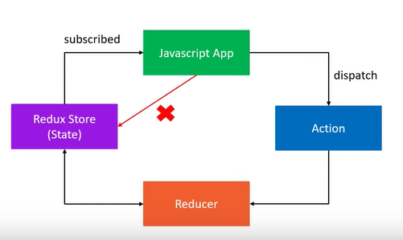

# redux-toolkit-tutorial

Source code for redux toolkit tutorial which I [followed:](https://www.youtube.com/watch?v=0awA5Uw6SJE&list=PLC3y8-rFHvwiaOAuTtVXittwybYIorRB3)

## Definitions

#### 1. Store - Holds the state of your application

#### 2. Action - an plain JS object that describes what happens in the application
Actions is the only way your application can interact with the store. Actions carry some information from your app to the redux store. They have the `type` property hich describes something that happens to the application. 

#### 3. Reducer - which describes the action and decides how to update the state

## Three Principles

1. The global state of your application is stored as an object inside a single store.
2. The only way to change the state is to dispatch an action(Do not allow to update the state directly)
3. To specify how the space tree is updated based on action write pure reducers

```
reducer = (previous_state, action) => next_state
```


